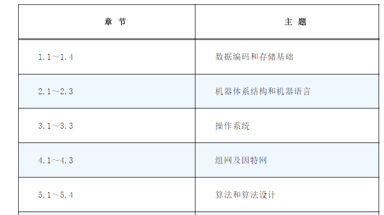

## Chapter 0——计算机科学就是算法的科学

#### 算法的作用
def：定义如何执行任务的一组步骤，*通俗的理解*：**作文的思路**，     
**程序**：def算法的表述，*作文的表述*  
**编程**：构建程序的**工序**
**软件**：程序与算法的最终**呈现**的效果。*作文的装裱出版*

##### 符号体系
实物→图像→符号，符号反过来対实物进行抽象指代，符号体系也会越来越抽象，转到计算机成为**最简洁的二进制**。*中文/英文的符号体系*

**算法举例**：
* 最大公约数算法：欧几里得算法
~~~
取两个数中较大的数做除数，较小的数做被除数，
用较大的数除以较小的数，如果余数为0，则较小数为这两个数的最大公约数。
如果余数不为0，用较小数除上一步计算出的余数，
直到余数为0，则这两个数的最大公约数为上一步的余数。
~~~
#### 算法的历史
只有存在执行某一项任务的算法时，我们才可以制造出执行这一任务的机器。换言之，如果我们找不到解决某问题的算法，机器就解决不了这个问题。换言之，算法的历史与计算的历史息息相关

1：数据的表示——————2：数据的存储————————3：计算的发展（算法的可编辑性）
用算盘的柱子表示数据——————算盘自身状态存储的数据——————巴贝奇的差分机的孔洞可编程性 （记得换表格）

电子管——————晶体管，将电信号→符号化→能运用在算法符号表示上→运用算法→解决问题

晶体管体积更小，寿命更高，利用半导体的特性将电流更好整流与控制，将计算的

**这学期最多学到第五章哈**

### 学习路径
数据存储——数据操控——操作系统——计算机网络——算法基础（算法效率之间的比较）
（这学的也太杂了吧我擦）

