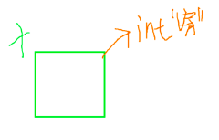
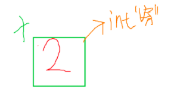

### 变量和常量

由小学方程式引出：

**观察与分析为重**：一样不变为constant；会随需求而变的为variable

**数据类型**：*一种变量的*`单位`

**为什么`data type`会放在data前面？**：

先定义空间，再放数据 *（一种“预约”的解释）*。预约→`声明`。“预约”要在填入数据之前，要不然没法分配大小。

### 语句
#### 分号
C语言中为了区分每一条命令，而整的一种区分符，`python就是直接省略了,一行一条指令`
#### 赋值与声明
把`data`放进‘预定’好的房子，而预定号房子这个过程，就叫做`声明`。而用新的`data` **完全替代** 原来的数据，这个行为就叫做`赋值`

 声明
 赋值
- **初始化** ：`声明`和`赋值`同时进行时的名字，如：
```c
int x = 2;
```
- **const**
~~~c
const int a = 6;
~~~
**WHY?const放在int前面**？: 
类似形容词的顺序，名词前最近的形容词，越能代表该名词的 **第一特征**，所以对于这块`内存空间`中 int 特征最明显，const次之。包括`long`与`short`，实际上也是一样的。

~~(实际大部分编译器根本不管你这个错误)~~

`long`：字节 × 2
- `long long`就是 × 4
  
`short`字节 / 2
- 但是并没有`short short`
  
`unsigned`：负数的字节扩容到正数

   **声明规则**：总之变量名不能让数字在最前面，但能允许下划线，
  
#### 字节长度
 `int`变量有4个字节，每个字节占8位（8bit，8个二进制码）————→ 数据量 = 2^n×8^

> 课程引入：使*在不扩增字节数的情况下*：扩增数据的表达量,所以有了更高的进制（？really？）

#### 符号位
符合人的习惯，将判断符号的第一位放在“最左侧”，但是使得本身数据类型能表达正负，但是符号位占了一个位，所以使得表达的正数含量要减去一个指数，不过总个数量是不变的；可以通 过`unsigned`adj来使符号位失效，**用于储存更多的正数**（实际也就多一个次方多*2，总数依然是不变的）

**强制检测八进制赋值问题（解释格式说明符）**：

```c
printf("%d %o %x");
````
键入的时候，可以靠%o与%x这种格式说明符强行把字符串转化成对应的进制（八进制，十六进制）

平时可以在 **数字最前面** ，通过特定的前缀来标识：
- **八进制（Octal）**：以`0`开头表示八进制数。
- **十六进制（Hexadecimal）**：以` 0x `或 `0X`开头表示十六进制数。
- **二进制（bit）**：以`0b`或`0B`开头表示二进制数。（**C99后才有**）

#### 浮点数
##### 浮点数在`cell`集合里的储存方式


一些浮点数的printf输出格式：

- 好像没有具体像讲int一样讲float的范围？可以问一下
~~~c
//这里面的小数点就是实际值的小数点位置
printf(".3%f") //小数点后面数值表示保留的小数位数（**自动四舍五入**），如果该值过大，则会补“空格”或0（GCC是补0吧）。
printf("10.3%f") //小数点前面的数值表示该浮点数所占的字节数
// （**但是如果本身超过了规定的值，会被无视掉**）
printf("-10.3%f") //减号代表左对齐，使补齐的空格往右边补
printf("+10.3%f") //这个加号不是正常的加，也不是右对齐，而是强制显示符号
~~~
#### 字符串

按照黄老师的理解，`char`就是`const short short int`。它只占用了**一**个字节，**然后通过权威机构把各字符对应起来（C语言ASCII码）。** ~~~JAVA用的是unicode~~~

> 一个人穿上**大白褂**就会变成医生。
> 但是他本身却是一个学生。
> **大白褂**使得他的身份转化

而字符串中的 **大白褂** 则是反斜杠`\`，名字为 ***转义字符*** 如`\n`即为换行符，通过该例子可以明白，转义字符将一些字符量，变成代表另一个 **char** 值的 **便捷方法**。

> \n 例子可知，将 n（ASCII码 ；110）给直接成 ‘换行’（ASCII码：10）

- 再记一个：`\t`水平制表符（就是Tab键啦），ASCII码 = 9。


### 算术
#### 基本运算符highlight
`%`运算符是对整数进行位操作优化的，其本质上依赖于二进制整除操作。所以某一元为浮点数报错很正常的 **因为浮点数都不是基于二进制十进制转换来储存的**。

不管浮点数也不是完全用不了mod，还有`fmod`函数，不过他返回值也是一个`double`浮点数罢了。

#### “x++（后置递增）与++x（前置递增）”
辨析
~~~c
#include<stdio.h>

int main(){
    int x = 1;
    printf("%d\n",++x);
    printf("%d\n",x);

    return 0;
    //output : 1，2
}
~~~
`前置递增`为，**先使用后增加**，**先**返回当前值，再进行递增
~~~c
#include<stdio.h>

int main(){
    int x = 1;
    printf("%d\n",x++);
    printf("%d\n",x);

    return 0;
    //output: 2，2
}

~~~
`后置递增`为，**先增加，后使用**，**先**递增，再返回值。

~~实际上我从来都是把x++当成单独的语句来整的，也是第一次知道这个知识点，我还以为只是个人习惯不同~~

这个知识点对`for`的`()`影响微乎其微

不过`++x`确实也有性能上微弱的提升（不需要建立临时副本），但其实现在编译器也没什么必要。


#### 二元运算符
> 黄老师解释`printf("%d",10.0/3);` : 10.0的官职比较大（它掌握了整数和小数部分），小的要像大官“靠拢”，所以“弱”一点数据类型转化成强一点的数据类型。

所以当 **数据类型不一样的变量** 进行运算时，要把“弱”转换成“强”，这幢转换就叫做：
#### **隐式类型转换**
规则：主要是为了信息的完整性（若小变大则会导致数据的`截断`，比如数据的溢出`long 转 short`和精度的丢失`float 转 int`）和 **算术一致性**。

饮食类型转化具体的规则：

> - **有符号类型（signed）**：如果较小的有符号类型被转换为较大的有符号类型，**符号位扩展**会发生。例如，一个 `char`（1 字节）转换为 `int`（4 字节）时，会将最高位（符号位）扩展到新的高位字节中，以保持正负号的一致性。这叫做**符号扩展**。
>   举例说明：
> ```c
> char a = -5;  // char 类型是 1 个字节
> int b = a;    // int 类型是 4 个字节，符号扩展
> // 在内存中，-5 可能表示为 11111011（二进制），转换后 b 为 11111111 > 11111111 11111111 11111011
>   ```
  

> - **无符号类型（unsigned）**：如果较小的无符号类型被提升为较大的无符号类型，**零扩展**会发生。即高位的额外字节都填充为 0。
>  举例说明：
>  ```c
>  unsigned char a = 200; // 200 的二进制为 11001000
>  unsigned int b = a;    // 转换后，b 为 00000000 00000000 00000000 11001000
>  ```

其实还有一种
#### 强制转换
也比较通俗易懂
~~~c
int c = 98
printf("%d",c);
char c = (char)x;
~~~
就两种途径（目前可以用到的），可提供更高的用户自由度，但是一般来时很难用到。

#### 比较运算符
`>` `<` `==` `!=`成立就返回 1 。不成立就返回 0.
#### 逻辑运算符

**只有** 与`&&`， 或`||`， 非`!`。这个是条件判断，所以 **没有异或**。异或要在位运算里才能见得到

**短路现象**：如果结果已经可以确定，**后续的表达式将不会被计算**。这种机制可以提高程序效率，同时避免不必要的计算

**优先级**：`!`

#### 位运算
在整数类型上返回一个布尔值
如
~~~c
int result = a & b;  // 对 a 和 b 的每个位进行与运算
~~~


