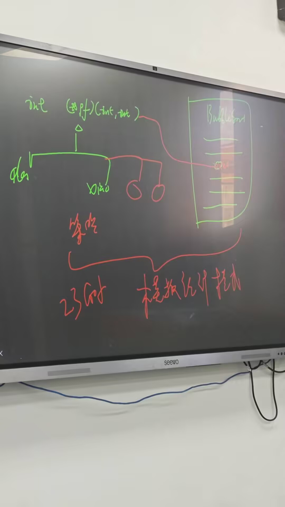

## 数组
现在看一则代码：
```c
int main(){
    int a0 = 0  ;
    int a1 = 1;
    int a2 = 2;
    int a3 = 3;
    int a4 = 4;
    int a5 = 5;
    int a6 = 6;
    int a7 = 7;
    int a8 = 8;
    int a9 = 9;
    //这样看，似乎没什么问题，但是，如果我们要定义100个变量呢？如果一个一个定义，那岂不是要累死？并且，你没有发现，这些变量名，似乎有某种规律？

    //这时候，数组就派上用场了。
    int a[10] = {0,1,2,3,4,5,6,7,8,9};
    return 0;
}
```
- 由此可见，定义数组可以大大简化我们定义**有某种共性**的变量群的操作。

### `#define`的性质和在数组中的应用

#### `#define`的性质
- 实际上`#define`是直接替换，相当于文本替换，所以**不要在`#define`中定义太复杂的东西**，否则可能会出现一些意想不到的错误。
- 比如我这样定义
```c
#define a 10 +10
#define b (10 + 10)

//从值来看，a和b好像是不是一样的？
```
- 但是，如果我这样写
```c
#include <stdio.h>
#define a 10 +10
#define b (10 + 10)

int main(){
    printf("%d\n",a * 10);      //输出110
    printf("%d\n",b * 10);      //输出200
    return 0;
}
```
- 调用b的时候，直接把#define b后面的值全给替换掉了，包括括号符号。所以运算所以才导致看似一样的宏定义，结果不一样。

甚至，宏定义还可以直接定义一块命令，比如
```c
#define SWAP(a, b) { int temp = a; a = b; b = temp; } 

int main() {
    int a = 10, b = 20;
    SWAP(a, b);
    printf("%d %d\n", a, b);
    return 0;
}
```
- 宏定义中花括号的作用，是让宏定义中的命令，作为一个整体，而不会被拆分。

#### `#define`在数组中的应用
- 数组中，我们也可以使用宏定义，来定义数组的长度。
```c
#define N 10
int main(){
    int a[N];
    return 0;
}
```
这是定义数组长度最典型的用法

- 但问题来了，显然，我也可以在main函数里初始化一个变量，或者直接使用一个全局变量，来定义数组的长度。为什么还是需要使用宏定义来定义数组的长度呢？
  - 1.数组的长度必须在编译时就确定，也就是说必须是常量。使用变量来定义数组长度在很多编译器中是不被允许的
  - 2.#define是预处理指令，在**编译之前就会进行文本替换**。这意味着：
    - 1.不会占用内存空间
    - 2.执行效率更高

### 函数调用数组
数组的`名字`本质上也是一种`指针`
> 在上一个函数和指针的笔记中，我们光是一个swap函数，就被指针搞的难以理解，但是我们用同样的思路，放在需要接受数组参数的函数上面试一下，会发生什么？

一段简单的函数使一个五元素数组中每个元素都自增1：
```c
#include <stdio.h>
void add_one(int arr[5]){       
    //这个[5]其实更像一种**注释**
    //但和注释不一样的是，它确实会影响函数的行为。他实际上还是预先声明了这个数组大小
    //无论数组大小是不是5，这个函数都可以使用，编译器并不会检查数组大小，就像这块代码，我把[5]改成[99999]，它也不会报错。只不过会造成内存的浪费的可能
    //如果我在此声明的数组大小小于实际传入数组大小，编译器也不会报错，它会被编译器转换为指针（int* arr）
    //这也是C语言中一个潜在的危险点，数组作为参数传递时会丢失大小信息

    for(int i = 0; i < 5; i++){
        arr[i]++;
        printf("%d ", arr[i]);
    }
}

int main(){
    int arr[5] = {0, 1, 2, 3, 4};
    add_one(arr);
    return 0;
}
```
- 运行一下发现。卧槽，为什么这个就这么简单？？不像我定义那个swap函数一样，用一堆指针指来指去，这个直接就传入数组名，就能达到我想要的效果了？
    - 思考一下，其实真相只有一个，那就是————**数组名，本质上也是一个地址。**
    - 并且数组名的地址，等价于**数组首元素**的地址。
- 那么数组名算不算是一种指针呢？
    - 算，而指针本质上也是一个地址。但是也有区别，指针可以被任意修改指向，但数组名不可以，不能対数组名实现 `arr = someOtherPointer;`这种操作。但怎么说呢，因为数组名是首元素的地址，所以数组可以作为函数参数传递，但这个时候，数组就被完全视为指针了。这也是为什么，数组作为函数参数传递时，会丢失大小信息。
    - 因此，在主函数中定义数组并且让数组自增，这个操作是不合法的，但把它转换成指针变量后，就可以正常赋值了

所以打印一个数组，共有以下五种做法
- 第一种，直接传递数组名，然后用一个循环直接打印
```c
#include <stdio.h>
void print_array1(int arr[], int size){
    for(int i = 0; i < size; i++){
        printf("%d ", arr[i]);
    }
}
```
- 第二种，把数组名完全看成指针，然后使用数组名自增打印
```c
#include <stdio.h>
void print_array2(int* arr, int size){
    for(int i = 0; i < size; i++){
        printf("%d ", *(arr + i));
    }
}
```
- 第三种，在函数中新定义一个指针pa，然后使用指针打印
```c
#include <stdio.h>
void print_array3(int* arr, int size){
    int* pa = arr;
    for(int i = 0; i < size; i++){
        printf("%d ", *pa);
        pa++;
    }
}
```
- 第四种，在循环中，使用指针自增打印
```c
#include <stdio.h>
void print_array4(int* arr, int size){
    int* ptr;
    for (ptr = arr; ptr < arr + size; ptr++) {
        printf("%d ", *ptr);
    }
}
```

### 数组排序
#### 冒泡排序
算是一种比较好理解的排序方法，时间复杂度为O(n^2)
示例代码：
总体思路就是，如果**左边大于右边**那就**交换**一趟，这样一个周期下来排下来最大的在右边。


思路好理解，代码当然也好理解，试着写一下：
```c
void bubble_sort(int arr[], int size){
    for(int i = 0; i < size - 1; i++){ 
        /*为什么是size - 1？
        每一个外循环的结果都是把最大的元素放在最后
        所以最后一个元素不需要再进行比较了。*/
        for(int j = 0; j < size - 1 - i; j++){
            /*为什么是size - 1 - i？
            当i到某个值的时候，
            就意味着前面的i个元素已经在他该在的位置了，
            当然内部循环的左右比较交换步数也得减去i
            */
            if(arr[j] > arr[j + 1]){
                int temp = arr[j];
                arr[j] = arr[j + 1];
                arr[j + 1] = temp;
            }
        }
    }
}
```
>先说一下推理过程吧，因为一个初学者并没有那么容易去想到“双层循环”这个概念，我先来推理一下
>首先，肯定是很容易想到若果左边大于右边就，就写一个的交换的函数吧
当然这样排完，数组是反序的，如果想要正序，只需要把`if(arr[j] > arr[j + 1])`改成`if(arr[j] < arr[j + 1])`即可。意思就是，如果左边小于右边，那就交换。
- 冒泡排序非常简单易懂，但是时间复杂度来说，无论是怎么样的一个数组，他的时间复杂度都是O(n^2)，所以效率并不高。
- 当然，如果数组已经有序，那么就不需要再进行排序了，所以可以加一个标志位，如果一趟下来没有发生交换，那么就说明数组已经有序，可以提前退出循环。这样可以稍微提高一点冒泡排序的效率。
  <br>
- 至于为什么叫冒泡排序，因为在每次循环中，最大的元素会像气泡一样，慢慢**浮**到数组的末尾，所以叫冒泡排序。

#### 选择排序
- **简单解释算法：** 找到最值往后面or前面扔就行了
- 
  
哪还有没有其他的排序方法呢？
冒泡排序是我已经学过的，所以我理解比较快，跳过了推理过程，接下来，我会以一个“开发者”的视角，来学习推理一下同样时间复杂度为O(n^2)的选择排序。
```c
#include <stdio.h>
void swap(int* a,int* b){
    int temp = *a;
    *a = *b;
    *b = temp;
}
void print_arr1(int arr[],int size){
	int i;
	for(i = 0; i < size; i++){
		printf("%d\n",arr[i]);
	}
    printf("\n");
}
int main(){
    int a[5] = {3,2,6,8,1};
    int max,max_index = 0;
    //这个max_index是用来记录最大值的下标的
    //然后我们用最原始的分支判断继续一个一个遍历
    max = a[0];
    if(max < a[1]){
    max = a[1];
        max_index = 1;
    }
    if(max < a[2]){
        max = a[2];
        max_index = 2;
    }
    if(max < a[3]){
        max = a[3];
        max_index = 3;
    }
    if(max < a[4]){
    max = a[4];
    max_index = 4;
    }
    //这样很容易就找到了最大值，并且也找到了最大值的下标，虽然很麻烦，但是我们至少搞定了数组的最后一位
    swap(&a[max_index],&a[4]);
    

    //我们之前学循环语句的时候就知道，重复的分支语句，可以用循环来简化，所以，后面的步骤我们用循环来简化

    //重新再列一个数组来操作吧！
    void select_sort(int* arr,int size){
    for(int i = size - 1; i > 0; i--){
        int max = arr[0];
        int max_index = 0;
        for(int j = 0; j <= i;j++){
            if(max < arr[j]){
                max = arr[j];
                max_index = j;
            }
        }
        swap(&arr[max_index],&arr[i]);
    }
    }
    int b[5] = {3,2,6,8,1};
    select_sort(b,5);
    print_arr1(b,5);

    return 0;
}

```

##### 拓展：在冒泡排序中体现面向对象思想：
观察一下冒泡排序
core bubblesorrt(int* a,int (*pf)(int)(int))
里面的指针参数决定着冒泡排序的正序or倒序


设计模式
```c
#include <stdio.h>

// 定义比较函数类型
typedef int (*CompareFunc)(int, int);

// 比较函数：升序
int ascending(int a, int b) {
    return a > b; // 如果a大于b，返回1（true）
}

// 比较函数：降序
int descending(int a, int b) {
    return a < b; // 如果a小于b，返回1（true）
}

// 冒泡排序函数
void bubble_sort(int arr[], int size, CompareFunc compare) {
    for (int i = 0; i < size - 1; i++) {
        for (int j = 0; j < size - 1 - i; j++) {
            if (compare(arr[j], arr[j + 1])) {
                // 交换
                int temp = arr[j];
                arr[j] = arr[j + 1];
                arr[j + 1] = temp;
            }
        }
    }
}
```